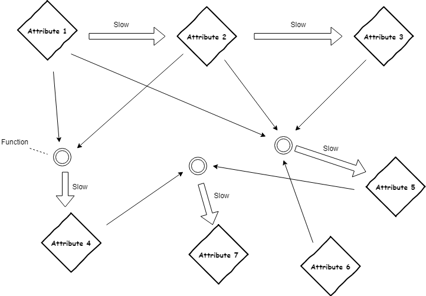

# DataflowAttributes
This is minimalistic, pure-python module for efficiently handling "acyclic dependencies" in your Python class attributes.

In other words, this module takes care of automatically and efficiently updating attributes that depend on other attributes, no matter how complicated the dependency graph. 

A typical use-case is hyperparameter optimization: A class could represent a system you are trying to optimize, and its independent attributes (controls, or hyperparameters) are things you control about the system. Dependent (determinant) attributes are then affected by these controls. The goal is to find the "best" controls/hyperparameters by changing them and seeing how they affect the dependent values. Changing one control might cause every dependent attribute of the system to change, while another control might only effect a few dependent attributes. Thus it is possible to avoid unncessary calculation if you know which attributes affect which other attributes.

This module does exactly that by modifying the way python class attributes work by using the python [descriptor protocol](https://docs.python.org/3/howto/descriptor.html). Here, class attributes know which attributes they depend on, which attributes they affect, and how to update their own value. Setting/modifying the value of an attribute results in a cascade of messages informing dependent attributes they need to be recalculated in the future. This recalculation occurs only when actually using/getting the value of an attribute that needs to be recalculated.

For instance, consider a class that has attributes a1 through a7, with a dependency structure shown below:



Changing the independent attributes 1 or 6 (`a1` and `a6` in the example code) will change the values of the attributes they affect. Changing attribute 1 (`a1`) will affect every attribute value (except `a6`), and so all values should be updated before they are used. Changing attribute 6 (`a6`) will affect only attribute 5 and 7, and so we don't need to update all attribute values, just `a5` and `a7`.

Rather than updating every attribute when any change is made, this module automatically updates only the required attributes, and only when the value of an attribute is actually requested.

The module is very simple to use. When you are defining your class attributes, simply define their dependency structure using the module's descriptor classes. 

You can use the main descriptor class for a uniform-looking syntax:

```python
  class DataflowSuccess():

        # The following defines the directed acyclic computation graph for these attributes.
        a1 = DependentAttr(1, [], None, 'a1')
        a2 = DependentAttr(None, ['a1'], 'update_a2', 'a2')
        a3 = DependentAttr(None, ['a2'], 'update_a3', 'a3')
        a4 = DependentAttr(None, ['a1','a2'], 'update_a4', 'a4')
        a5 = DependentAttr(None, ['a1','a2','a3','a6'], 'update_a5', 'a5')
        a6 = DependentAttr(6, [], None, 'a6')
        a7 = DependentAttr(None, ['a4','a5'], 'update_a7', 'a7')

        # ...... define the update functions update_a2, update_a3 etc
        def update_a2():
            ....
 ```
 
 The arguments supplied above to `DependentAttr` are the initial value of the attribute, the names of the attributes that attribute depends on, the name of the member function responsible for updating its value, and its attribute name.
 
Similarly, you can use its subclasses for a more explicit syntax:
 
 ```python
     class DataflowSuccess():
    
        # The following defines the directed acyclic computation graph for these attributes.
        a1 = IndependentAttr(1, 'a1')
        a2 = DeterminantAttr(['a1'], 'update_a2', 'a2')
        a3 = DeterminantAttr(['a2'], 'update_a3', 'a3')
        a4 = DeterminantAttr(['a1','a2'], 'update_a4', 'a4')
        a5 = DeterminantAttr(['a1','a2','a3','a6'], 'update_a5', 'a5')
        a6 = IndependentAttr(6, 'a6')
        a7 = DeterminantAttr(['a4','a5'], 'update_a7', 'a7')
 ```
The module takes care of the rest (setting values, getting values, and updating values). Running the example (execute the module) shows how this works. Give it a try! Attributes 1, 2, etc. in the diagram correspond to `a1`, `a2`, etc. in the example code:
 
 ```
   ------------- Testing the bad way of updating dependent attributes ------------
  a2 updated to (1+2)
  a3 updated to ((1+2)+3)
  a4 updated to (1*(1+2)+4)
  a5 updated to (1+(1+2)+((1+2)+3)*6+5)
  a7 updated to ((1*(1+2)+4)*(1+(1+2)+((1+2)+3)*6+5)+7)
  Expression equals 322 vs expected 322
  SUCCESS!
  Attribute a7 is ((1*(1+2)+4)*(1+(1+2)+((1+2)+3)*6+5)+7)

  Changing a6 to 4 affects a5 and therefore a7.
  However, after changing a6, attribute a7 is still ((1*(1+2)+4)*(1+(1+2)+((1+2)+3)*6+5)+7)

  Updating the value of a7 doesn't work without updating at least a5 first:
  a7 updated to ((1*(1+2)+4)*(1+(1+2)+((1+2)+3)*6+5)+7)
  Expression equals 322 vs expected 238
  Failure.
  Attribute a7 is ((1*(1+2)+4)*(1+(1+2)+((1+2)+3)*6+5)+7)

  Only a costly full update guarantees in all scenarios the correct value of a7:
  a2 updated to (1+2)
  a3 updated to ((1+2)+3)
  a4 updated to (1*(1+2)+4)
  a5 updated to (1+(1+2)+((1+2)+3)*4+5)
  a7 updated to ((1*(1+2)+4)*(1+(1+2)+((1+2)+3)*4+5)+7)
  Expression equals 238 vs expected 238
  SUCCESS!
  Attribute a7 is ((1*(1+2)+4)*(1+(1+2)+((1+2)+3)*4+5)+7)


  --------------- Testing the good way using explicitly-dependent attributes -------------
  a2 updated to (1+2)
  a4 updated to (1*(1+2)+4)
  a3 updated to ((1+2)+3)
  a5 updated to (1+(1+2)+((1+2)+3)*6+5)
  a7 updated to ((1*(1+2)+4)*(1+(1+2)+((1+2)+3)*6+5)+7)
  Expression equals 322 vs expected 322
  SUCCESS!
  Attribute a7 is ((1*(1+2)+4)*(1+(1+2)+((1+2)+3)*6+5)+7)

  Changing a6 to 4 affects the value of a5 and therefore a7.
  Getting the value of a7 auto-triggers updating the only affected dependency a5 first.
  a5 updated to (1+(1+2)+((1+2)+3)*4+5)
  a7 updated to ((1*(1+2)+4)*(1+(1+2)+((1+2)+3)*4+5)+7)
  Expression equals 238 vs expected 238
  SUCCESS!
  Attribute a7 is ((1*(1+2)+4)*(1+(1+2)+((1+2)+3)*4+5)+7)

  Now changing a1 to 9, which affects a2, a3, a4, a5, and a7.
  Getting the value of a4 auto-triggers updating only a4's required dependencies.
  a2 updated to (9+2)
  a4 updated to (9*(9+2)+4)
  Attribute a4 is (9*(9+2)+4)
  Getting the value of a7 auto-triggers only the remaining dependencies.
  a3 updated to ((9+2)+3)
  a5 updated to (9+(9+2)+((9+2)+3)*4+5)
  a7 updated to ((9*(9+2)+4)*(9+(9+2)+((9+2)+3)*4+5)+7)
  Expression equals 8350 vs expected 8350
  SUCCESS!
  Attribute a7 is ((9*(9+2)+4)*(9+(9+2)+((9+2)+3)*4+5)+7)
  ```
